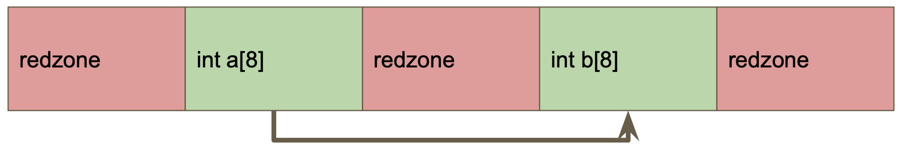

# **Lab 6 Valgrind & Sanitizer**

## **Environments**  
編譯環境
```
gcc --version
- Gcc (Ubuntu 11.3.0-1ubuntu1~22.04) 11.3.0
```
---
## **第一題**
## **Heap out-of-bounds read/write**
Source Code :
```c
# include <stdio.h>
# include <stdlib.h>
# include <string.h>

int main() {
    char *str = malloc(4) ;
    str[4] = 'a' ;
    printf("%c\n", str[4]) ;
    free(str) ;
    return 0 ;
}
```
ASan report :
```bash
==3207==ERROR: AddressSanitizer: heap-buffer-overflow on address 0xffff868007b4 at pc 0xaaaac0120b38 bp 0xffffd20535b0 sp 0xffffd20535c0
WRITE of size 1 at 0xffff868007b4 thread T0
    #0 0xaaaac0120b34 in main /home/yucheng/Documents/software_testing/Lab06/head_out_of_bounds.c:7
    #1 0xffff8ab173f8 in __libc_start_call_main ../sysdeps/nptl/libc_start_call_main.h:58
    #2 0xffff8ab174c8 in __libc_start_main_impl ../csu/libc-start.c:392
    #3 0xaaaac01209ec in _start (/home/yucheng/Documents/software_testing/Lab06/test_heap_out_of_bounds+0x9ec)

0xffff868007b4 is located 0 bytes to the right of 4-byte region [0xffff868007b0,0xffff868007b4)
allocated by thread T0 here:
    #0 0xffff8ad4a2f4 in __interceptor_malloc ../../../../src/libsanitizer/asan/asan_malloc_linux.cpp:145
    #1 0xaaaac0120ae0 in main /home/yucheng/Documents/software_testing/Lab06/head_out_of_bounds.c:6
    #2 0xffff8ab173f8 in __libc_start_call_main ../sysdeps/nptl/libc_start_call_main.h:58
    #3 0xffff8ab174c8 in __libc_start_main_impl ../csu/libc-start.c:392
    #4 0xaaaac01209ec in _start (/home/yucheng/Documents/software_testing/Lab06/test_heap_out_of_bounds+0x9ec)

SUMMARY: AddressSanitizer: heap-buffer-overflow /home/yucheng/Documents/software_testing/Lab06/head_out_of_bounds.c:7 in main
Shadow bytes around the buggy address:
  0x200ff0d000a0: fa fa fa fa fa fa fa fa fa fa fa fa fa fa fa fa
  0x200ff0d000b0: fa fa fa fa fa fa fa fa fa fa fa fa fa fa fa fa
  0x200ff0d000c0: fa fa fa fa fa fa fa fa fa fa fa fa fa fa fa fa
  0x200ff0d000d0: fa fa fa fa fa fa fa fa fa fa fa fa fa fa fa fa
  0x200ff0d000e0: fa fa fa fa fa fa fa fa fa fa fa fa fa fa fa fa
=>0x200ff0d000f0: fa fa fa fa fa fa[04]fa fa fa fa fa fa fa fa fa
  0x200ff0d00100: fa fa fa fa fa fa fa fa fa fa fa fa fa fa fa fa
  0x200ff0d00110: fa fa fa fa fa fa fa fa fa fa fa fa fa fa fa fa
  0x200ff0d00120: fa fa fa fa fa fa fa fa fa fa fa fa fa fa fa fa
  0x200ff0d00130: fa fa fa fa fa fa fa fa fa fa fa fa fa fa fa fa
  0x200ff0d00140: fa fa fa fa fa fa fa fa fa fa fa fa fa fa fa fa
Shadow byte legend (one shadow byte represents 8 application bytes):
  Addressable:           00
  Partially addressable: 01 02 03 04 05 06 07 
  Heap left redzone:       fa
  Freed heap region:       fd
  Stack left redzone:      f1
  Stack mid redzone:       f2
  Stack right redzone:     f3
  Stack after return:      f5
  Stack use after scope:   f8
  Global redzone:          f9
  Global init order:       f6
  Poisoned by user:        f7
  Container overflow:      fc
  Array cookie:            ac
  Intra object redzone:    bb
  ASan internal:           fe
  Left alloca redzone:     ca
  Right alloca redzone:    cb
  Shadow gap:              cc
==3207==ABORTING

```
Valgrind report :
```bash
==2160== Memcheck, a memory error detector
==2160== Copyright (C) 2002-2017, and GNU GPL'd, by Julian Seward et al.
==2160== Using Valgrind-3.18.1 and LibVEX; rerun with -h for copyright info
==2160== Command: ./head_out_of_bounds.out
==2160== 
==2160== Invalid write of size 1
==2160==    at 0x108834: main (in /home/yucheng/Documents/software_testing/Lab06/1/head_out_of_bounds.out)
==2160==  Address 0x4a4a044 is 0 bytes after a block of size 4 alloc'd
==2160==    at 0x4865058: malloc (in /usr/libexec/valgrind/vgpreload_memcheck-arm64-linux.so)
==2160==    by 0x108823: main (in /home/yucheng/Documents/software_testing/Lab06/1/head_out_of_bounds.out)
==2160== 
==2160== Invalid read of size 1
==2160==    at 0x108840: main (in /home/yucheng/Documents/software_testing/Lab06/1/head_out_of_bounds.out)
==2160==  Address 0x4a4a044 is 0 bytes after a block of size 4 alloc'd
==2160==    at 0x4865058: malloc (in /usr/libexec/valgrind/vgpreload_memcheck-arm64-linux.so)
==2160==    by 0x108823: main (in /home/yucheng/Documents/software_testing/Lab06/1/head_out_of_bounds.out)
==2160== 
a
==2160== 
==2160== HEAP SUMMARY:
==2160==     in use at exit: 0 bytes in 0 blocks
==2160==   total heap usage: 2 allocs, 2 frees, 1,028 bytes allocated
==2160== 
==2160== All heap blocks were freed -- no leaks are possible
==2160== 
==2160== For lists of detected and suppressed errors, rerun with: -s
==2160== ERROR SUMMARY: 2 errors from 2 contexts (suppressed: 0 from 0)
```
<font color=#FF0000, font size=5>**ASan 能, Valgrind能**
</font>

---
## **Stack out-of-bounds read/write**
Source Code :
```c
# include <stdio.h>

int main() {
    int arr[5];
    arr[5] = 6 ;
    return arr[5] ;
}
```
ASan report :
```bash
==2557==ERROR: AddressSanitizer: stack-buffer-overflow on address 0xfffff2ed1b84 at pc 0xaaaab4040acc bp 0xfffff2ed1b10 sp 0xfffff2ed1b20
WRITE of size 4 at 0xfffff2ed1b84 thread T0
    #0 0xaaaab4040ac8 in main /home/yucheng/Documents/software_testing/Lab06/1/stack_out_of_bounds.c:5
    #1 0xffff8e1273f8 in __libc_start_call_main ../sysdeps/nptl/libc_start_call_main.h:58
    #2 0xffff8e1274c8 in __libc_start_main_impl ../csu/libc-start.c:392
    #3 0xaaaab40408ec in _start (/home/yucheng/Documents/software_testing/Lab06/1/test_stack_out_of_bounds+0x8ec)

Address 0xfffff2ed1b84 is located in stack of thread T0 at offset 52 in frame
    #0 0xaaaab40409e0 in main /home/yucheng/Documents/software_testing/Lab06/1/stack_out_of_bounds.c:3

  This frame has 1 object(s):
    [32, 52) 'arr' (line 4) <== Memory access at offset 52 overflows this variable
HINT: this may be a false positive if your program uses some custom stack unwind mechanism, swapcontext or vfork
      (longjmp and C++ exceptions *are* supported)
SUMMARY: AddressSanitizer: stack-buffer-overflow /home/yucheng/Documents/software_testing/Lab06/1/stack_out_of_bounds.c:5 in main
Shadow bytes around the buggy address:
  0x200ffe5da320: 00 00 00 00 00 00 00 00 00 00 00 00 00 00 00 00
  0x200ffe5da330: 00 00 00 00 00 00 00 00 00 00 00 00 00 00 00 00
  0x200ffe5da340: 00 00 00 00 00 00 00 00 00 00 00 00 00 00 00 00
  0x200ffe5da350: 00 00 00 00 00 00 00 00 00 00 00 00 00 00 00 00
  0x200ffe5da360: 00 00 00 00 00 00 00 00 00 00 f1 f1 f1 f1 00 00
=>0x200ffe5da370:[04]f3 f3 f3 f3 f3 00 00 00 00 00 00 00 00 00 00
  0x200ffe5da380: 00 00 00 00 00 00 00 00 00 00 00 00 00 00 00 00
  0x200ffe5da390: 00 00 00 00 00 00 00 00 00 00 00 00 00 00 00 00
  0x200ffe5da3a0: 00 00 00 00 00 00 00 00 00 00 00 00 00 00 00 00
  0x200ffe5da3b0: 00 00 00 00 00 00 00 00 00 00 00 00 00 00 00 00
  0x200ffe5da3c0: 00 00 00 00 00 00 00 00 00 00 00 00 00 00 00 00
Shadow byte legend (one shadow byte represents 8 application bytes):
  Addressable:           00
  Partially addressable: 01 02 03 04 05 06 07 
  Heap left redzone:       fa
  Freed heap region:       fd
  Stack left redzone:      f1
  Stack mid redzone:       f2
  Stack right redzone:     f3
  Stack after return:      f5
  Stack use after scope:   f8
  Global redzone:          f9
  Global init order:       f6
  Poisoned by user:        f7
  Container overflow:      fc
  Array cookie:            ac
  Intra object redzone:    bb
  ASan internal:           fe
  Left alloca redzone:     ca
  Right alloca redzone:    cb
  Shadow gap:              cc
==2557==ABORTING
```
Valgrind report :
```bash
==2535== Memcheck, a memory error detector
==2535== Copyright (C) 2002-2017, and GNU GPL'd, by Julian Seward et al.
==2535== Using Valgrind-3.18.1 and LibVEX; rerun with -h for copyright info
==2535== Command: ./stack_out_of_bounds.out
==2535== 
==2535== 
==2535== HEAP SUMMARY:
==2535==     in use at exit: 0 bytes in 0 blocks
==2535==   total heap usage: 0 allocs, 0 frees, 0 bytes allocated
==2535== 
==2535== All heap blocks were freed -- no leaks are possible
==2535== 
==2535== For lists of detected and suppressed errors, rerun with: -s
==2535== ERROR SUMMARY: 0 errors from 0 contexts (suppressed: 0 from 0)
```
<font color=#FF0000, font size=5>**ASan 能, Valgrind不能**
</font>

---
## **Global out-of-bounds read/write**
Source Code :
```c
# include <stdio.h>

int global_arr[5] = {1, 2, 3, 4, 5} ;

int main() {
    printf("%d\n", global_arr[5]) ;
    global_arr[5] = 6 ;
    return 0 ;
}
```
ASan report :
```bash
==3404==ERROR: AddressSanitizer: global-buffer-overflow on address 0xaaaab8962034 at pc 0xaaaab8950b30 bp 0xffffd0f4b700 sp 0xffffd0f4b710
READ of size 4 at 0xaaaab8962034 thread T0
    #0 0xaaaab8950b2c in main /home/yucheng/Documents/software_testing/Lab06/global_out_of_bounds.c:6
    #1 0xffffb7f173f8 in __libc_start_call_main ../sysdeps/nptl/libc_start_call_main.h:58
    #2 0xffffb7f174c8 in __libc_start_main_impl ../csu/libc-start.c:392
    #3 0xaaaab89509ec in _start (/home/yucheng/Documents/software_testing/Lab06/test_global_out_of_bounds+0x9ec)

0xaaaab8962034 is located 0 bytes to the right of global variable 'global_arr' defined in 'global_out_of_bounds.c:3:5' (0xaaaab8962020) of size 20
SUMMARY: AddressSanitizer: global-buffer-overflow /home/yucheng/Documents/software_testing/Lab06/global_out_of_bounds.c:6 in main
Shadow bytes around the buggy address:
  0x15655712c3b0: 00 00 00 00 00 00 00 00 00 00 00 00 00 00 00 00
  0x15655712c3c0: 00 00 00 00 00 00 00 00 00 00 00 00 00 00 00 00
  0x15655712c3d0: 00 00 00 00 00 00 00 00 00 00 00 00 00 00 00 00
  0x15655712c3e0: 00 00 00 00 00 00 00 00 00 00 00 00 00 00 00 00
  0x15655712c3f0: 00 00 00 00 00 00 00 00 00 00 00 00 00 00 00 00
=>0x15655712c400: 00 00 00 00 00 00[04]f9 f9 f9 f9 f9 00 00 f9 f9
  0x15655712c410: f9 f9 f9 f9 f9 f9 f9 f9 f9 f9 f9 f9 f9 f9 00 00
  0x15655712c420: 00 00 00 00 00 00 00 00 00 00 00 00 00 00 00 00
  0x15655712c430: 00 00 00 00 00 00 00 00 00 00 00 00 00 00 00 00
  0x15655712c440: 00 00 00 00 00 00 00 00 00 00 00 00 00 00 00 00
  0x15655712c450: 00 00 00 00 00 00 00 00 00 00 00 00 00 00 00 00
Shadow byte legend (one shadow byte represents 8 application bytes):
  Addressable:           00
  Partially addressable: 01 02 03 04 05 06 07 
  Heap left redzone:       fa
  Freed heap region:       fd
  Stack left redzone:      f1
  Stack mid redzone:       f2
  Stack right redzone:     f3
  Stack after return:      f5
  Stack use after scope:   f8
  Global redzone:          f9
  Global init order:       f6
  Poisoned by user:        f7
  Container overflow:      fc
  Array cookie:            ac
  Intra object redzone:    bb
  ASan internal:           fe
  Left alloca redzone:     ca
  Right alloca redzone:    cb
  Shadow gap:              cc
==3404==ABORTING
```
Valgrind report :
```bash
// Valgrind report
==3382== Memcheck, a memory error detector
==3382== Copyright (C) 2002-2017, and GNU GPL'd, by Julian Seward et al.
==3382== Using Valgrind-3.18.1 and LibVEX; rerun with -h for copyright info
==3382== Command: ./global_out_of_bounds.out
==3382== 
0
==3382== 
==3382== HEAP SUMMARY:
==3382==     in use at exit: 0 bytes in 0 blocks
==3382==   total heap usage: 1 allocs, 1 frees, 1,024 bytes allocated
==3382== 
==3382== All heap blocks were freed -- no leaks are possible
==3382== 
==3382== For lists of detected and suppressed errors, rerun with: -s
==3382== ERROR SUMMARY: 0 errors from 0 contexts (suppressed: 0 from 0)
```
<font color=#FF0000, font size=5>**ASan 能, Valgrind不能**
</font>

---

## **Use-after-free**
Source Code :
```c
# include <stdlib.h>

int main() {
    int *ptr = malloc(5 * sizeof(int)) ;
    free(ptr) ;
    return ptr[1] ;
}
```
ASan report :
```bash
==3520==ERROR: AddressSanitizer: heap-use-after-free on address 0xffffac000b54 at pc 0xaaaadddc0984 bp 0xffffeea6d410 sp 0xffffeea6d420
READ of size 4 at 0xffffac000b54 thread T0
    #0 0xaaaadddc0980 in main /home/yucheng/Documents/software_testing/Lab06/use_after_free.c:6
    #1 0xffffafd373f8 in __libc_start_call_main ../sysdeps/nptl/libc_start_call_main.h:58
    #2 0xffffafd374c8 in __libc_start_main_impl ../csu/libc-start.c:392
    #3 0xaaaadddc082c in _start (/home/yucheng/Documents/software_testing/Lab06/test_use_after_free+0x82c)

0xffffac000b54 is located 4 bytes inside of 20-byte region [0xffffac000b50,0xffffac000b64)
freed by thread T0 here:
    #0 0xffffaff69fe8 in __interceptor_free ../../../../src/libsanitizer/asan/asan_malloc_linux.cpp:127
    #1 0xaaaadddc092c in main /home/yucheng/Documents/software_testing/Lab06/use_after_free.c:5
    #2 0xffffafd373f8 in __libc_start_call_main ../sysdeps/nptl/libc_start_call_main.h:58
    #3 0xffffafd374c8 in __libc_start_main_impl ../csu/libc-start.c:392
    #4 0xaaaadddc082c in _start (/home/yucheng/Documents/software_testing/Lab06/test_use_after_free+0x82c)

previously allocated by thread T0 here:
    #0 0xffffaff6a2f4 in __interceptor_malloc ../../../../src/libsanitizer/asan/asan_malloc_linux.cpp:145
    #1 0xaaaadddc0920 in main /home/yucheng/Documents/software_testing/Lab06/use_after_free.c:4
    #2 0xffffafd373f8 in __libc_start_call_main ../sysdeps/nptl/libc_start_call_main.h:58
    #3 0xffffafd374c8 in __libc_start_main_impl ../csu/libc-start.c:392
    #4 0xaaaadddc082c in _start (/home/yucheng/Documents/software_testing/Lab06/test_use_after_free+0x82c)

SUMMARY: AddressSanitizer: heap-use-after-free /home/yucheng/Documents/software_testing/Lab06/use_after_free.c:6 in main
Shadow bytes around the buggy address:
  0x200ff5800110: fa fa fa fa fa fa fa fa fa fa fa fa fa fa fa fa
  0x200ff5800120: fa fa fa fa fa fa fa fa fa fa fa fa fa fa fa fa
  0x200ff5800130: fa fa fa fa fa fa fa fa fa fa fa fa fa fa fa fa
  0x200ff5800140: fa fa fa fa fa fa fa fa fa fa fa fa fa fa fa fa
  0x200ff5800150: fa fa fa fa fa fa fa fa fa fa fa fa fa fa fa fa
=>0x200ff5800160: fa fa fa fa fa fa fa fa fa fa[fd]fd fd fa fa fa
  0x200ff5800170: 00 00 00 fa fa fa fa fa fa fa fa fa fa fa fa fa
  0x200ff5800180: fa fa fa fa fa fa fa fa fa fa fa fa fa fa fa fa
  0x200ff5800190: fa fa fa fa fa fa fa fa fa fa fa fa fa fa fa fa
  0x200ff58001a0: fa fa fa fa fa fa fa fa fa fa fa fa fa fa fa fa
  0x200ff58001b0: fa fa fa fa fa fa fa fa fa fa fa fa fa fa fa fa
Shadow byte legend (one shadow byte represents 8 application bytes):
  Addressable:           00
  Partially addressable: 01 02 03 04 05 06 07 
  Heap left redzone:       fa
  Freed heap region:       fd
  Stack left redzone:      f1
  Stack mid redzone:       f2
  Stack right redzone:     f3
  Stack after return:      f5
  Stack use after scope:   f8
  Global redzone:          f9
  Global init order:       f6
  Poisoned by user:        f7
  Container overflow:      fc
  Array cookie:            ac
  Intra object redzone:    bb
  ASan internal:           fe
  Left alloca redzone:     ca
  Right alloca redzone:    cb
  Shadow gap:              cc
==3520==ABORTING
```
Valgrind report :
```bash
==3492== Memcheck, a memory error detector
==3492== Copyright (C) 2002-2017, and GNU GPL'd, by Julian Seward et al.
==3492== Using Valgrind-3.18.1 and LibVEX; rerun with -h for copyright info
==3492== Command: ./use_after_free.out
==3492== 
==3492== Invalid read of size 4
==3492==    at 0x1087F4: main (in /home/yucheng/Documents/software_testing/Lab06/use_after_free.out)
==3492==  Address 0x4a4a044 is 4 bytes inside a block of size 20 free'd
==3492==    at 0x4867AD0: free (in /usr/libexec/valgrind/vgpreload_memcheck-arm64-linux.so)
==3492==    by 0x1087EF: main (in /home/yucheng/Documents/software_testing/Lab06/use_after_free.out)
==3492==  Block was alloc'd at
==3492==    at 0x4865058: malloc (in /usr/libexec/valgrind/vgpreload_memcheck-arm64-linux.so)
==3492==    by 0x1087E3: main (in /home/yucheng/Documents/software_testing/Lab06/use_after_free.out)
==3492== 
==3492== 
==3492== HEAP SUMMARY:
==3492==     in use at exit: 0 bytes in 0 blocks
==3492==   total heap usage: 1 allocs, 1 frees, 20 bytes allocated
==3492== 
==3492== All heap blocks were freed -- no leaks are possible
==3492== 
==3492== For lists of detected and suppressed errors, rerun with: -s
==3492== ERROR SUMMARY: 1 errors from 1 contexts (suppressed: 0 from 0)
```
<font color=#FF0000, font size=5>**ASan 能, Valgrind能**
</font>

---
## **Use-after-return**
Source Code :
```c
# include <stdio.h>
# include <stdlib.h>

int *ptr ;
__attribute__((noinline))
void FunctionThatEscapesLocalObject() {
    int local[100] ;
    ptr = &local[0] ;
}

int main(int argc, char **argv) {
    FunctionThatEscapesLocalObject() ;
    return ptr[argc] ;
}
```
ASan report :
```bash
==3974==ERROR: AddressSanitizer: stack-use-after-return on address 0xffff9169a034 at pc 0xaaaabaf60d00 bp 0xffffea0a48a0 sp 0xffffea0a48b0
READ of size 4 at 0xffff9169a034 thread T0
    #0 0xaaaabaf60cfc in main /home/yucheng/Documents/software_testing/Lab06/use_after_return.c:13
    #1 0xffff94af73f8 in __libc_start_call_main ../sysdeps/nptl/libc_start_call_main.h:58
    #2 0xffff94af74c8 in __libc_start_main_impl ../csu/libc-start.c:392
    #3 0xaaaabaf60a6c in _start (/home/yucheng/Documents/software_testing/Lab06/test_use_after_return+0xa6c)

Address 0xffff9169a034 is located in stack of thread T0 at offset 52 in frame
    #0 0xaaaabaf60b60 in FunctionThatEscapesLocalObject /home/yucheng/Documents/software_testing/Lab06/use_after_return.c:6

  This frame has 1 object(s):
    [48, 448) 'local' (line 7) <== Memory access at offset 52 is inside this variable
HINT: this may be a false positive if your program uses some custom stack unwind mechanism, swapcontext or vfork
      (longjmp and C++ exceptions *are* supported)
SUMMARY: AddressSanitizer: stack-use-after-return /home/yucheng/Documents/software_testing/Lab06/use_after_return.c:13 in main
Shadow bytes around the buggy address:
  0x200ff22d33b0: 00 00 00 00 00 00 00 00 00 00 00 00 00 00 00 00
  0x200ff22d33c0: 00 00 00 00 00 00 00 00 00 00 00 00 00 00 00 00
  0x200ff22d33d0: 00 00 00 00 00 00 00 00 00 00 00 00 00 00 00 00
  0x200ff22d33e0: 00 00 00 00 00 00 00 00 00 00 00 00 00 00 00 00
  0x200ff22d33f0: 00 00 00 00 00 00 00 00 00 00 00 00 00 00 00 00
=>0x200ff22d3400: f5 f5 f5 f5 f5 f5[f5]f5 f5 f5 f5 f5 f5 f5 f5 f5
  0x200ff22d3410: f5 f5 f5 f5 f5 f5 f5 f5 f5 f5 f5 f5 f5 f5 f5 f5
  0x200ff22d3420: f5 f5 f5 f5 f5 f5 f5 f5 f5 f5 f5 f5 f5 f5 f5 f5
  0x200ff22d3430: f5 f5 f5 f5 f5 f5 f5 f5 f5 f5 f5 f5 f5 f5 f5 f5
  0x200ff22d3440: 00 00 00 00 00 00 00 00 00 00 00 00 00 00 00 00
  0x200ff22d3450: 00 00 00 00 00 00 00 00 00 00 00 00 00 00 00 00
Shadow byte legend (one shadow byte represents 8 application bytes):
  Addressable:           00
  Partially addressable: 01 02 03 04 05 06 07 
  Heap left redzone:       fa
  Freed heap region:       fd
  Stack left redzone:      f1
  Stack mid redzone:       f2
  Stack right redzone:     f3
  Stack after return:      f5
  Stack use after scope:   f8
  Global redzone:          f9
  Global init order:       f6
  Poisoned by user:        f7
  Container overflow:      fc
  Array cookie:            ac
  Intra object redzone:    bb
  ASan internal:           fe
  Left alloca redzone:     ca
  Right alloca redzone:    cb
  Shadow gap:              cc
==3974==ABORTING
```
Valgrind report :
```bash
==3943== Memcheck, a memory error detector
==3943== Copyright (C) 2002-2017, and GNU GPL'd, by Julian Seward et al.
==3943== Using Valgrind-3.18.1 and LibVEX; rerun with -h for copyright info
==3943== Command: ./use_after_return.out
==3943== 
==3943== Invalid read of size 4
==3943==    at 0x108898: main (in /home/yucheng/Documents/software_testing/Lab06/use_after_return.out)
==3943==  Address 0x1ffefffd5c is on thread 1's stack
==3943==  404 bytes below stack pointer
==3943== 
==3943== 
==3943== HEAP SUMMARY:
==3943==     in use at exit: 0 bytes in 0 blocks
==3943==   total heap usage: 0 allocs, 0 frees, 0 bytes allocated
==3943== 
==3943== All heap blocks were freed -- no leaks are possible
==3943== 
==3943== For lists of detected and suppressed errors, rerun with: -s
==3943== ERROR SUMMARY: 1 errors from 1 contexts (suppressed: 0 from 0)
```
<font color=#FF0000, font size=5>**ASan 能, Valgrind能**
</font>

---
### **Lab 6**

|                      | Valgrind | ASAN |
|----------------------|:--------:|:----:|
| Heap out-of-bounds   |     V    |   V  |
| Stack out-of-bounds  |     V    |   X  |
| Global out-of-bounds |     V    |   X  |
| Use-after-free       |     V    |   V  |
| Usd-after-return     |     V    |   V  |

---
## **第二題**
## **Problem**
寫一個簡單程式 with ASan，Stack buffer overflow 剛好越過 redzone(並沒有對 redzone 做讀寫)，並說明 ASan 能否找的出來？



<font color=#FF0000, font size=5>**結論是ASan找不出來**</font><font size=5>, 以下用兩個Test cases來驗證</font>

找到錯誤的情況 :
```c
# include <stdio.h>
# include <stdlib.h>

int main(int argc, char **argv) {
    int *a = malloc(8 *sizeof(int)) ;
    int *b = malloc(8 *sizeof(int)) ;
    int res = a[argc+8] ;
    free(a) ;
    free(b) ;
    return res ;
}
```
ASan report :
```bash
==4062==ERROR: AddressSanitizer: heap-buffer-overflow on address 0xffff93b00b74 at pc 0xaaaabed609a0 bp 0xffffcc977e30 sp 0xffffcc977e40
READ of size 4 at 0xffff93b00b74 thread T0
    #0 0xaaaabed6099c in main /home/yucheng/Documents/software_testing/Lab06/2/Lab06_2_1.c:7
    #1 0xffff977873f8 in __libc_start_call_main ../sysdeps/nptl/libc_start_call_main.h:58
    #2 0xffff977874c8 in __libc_start_main_impl ../csu/libc-start.c:392
    #3 0xaaaabed6082c in _start (/home/yucheng/Documents/software_testing/Lab06/2/Lab06_2_1+0x82c)

0xffff93b00b74 is located 4 bytes to the right of 32-byte region [0xffff93b00b50,0xffff93b00b70)
allocated by thread T0 here:
    #0 0xffff979ba2f4 in __interceptor_malloc ../../../../src/libsanitizer/asan/asan_malloc_linux.cpp:145
    #1 0xaaaabed60928 in main /home/yucheng/Documents/software_testing/Lab06/2/Lab06_2_1.c:5
    #2 0xffff977873f8 in __libc_start_call_main ../sysdeps/nptl/libc_start_call_main.h:58
    #3 0xffff977874c8 in __libc_start_main_impl ../csu/libc-start.c:392
    #4 0xaaaabed6082c in _start (/home/yucheng/Documents/software_testing/Lab06/2/Lab06_2_1+0x82c)

SUMMARY: AddressSanitizer: heap-buffer-overflow /home/yucheng/Documents/software_testing/Lab06/2/Lab06_2_1.c:7 in main
Shadow bytes around the buggy address:
  0x200ff2760110: fa fa fa fa fa fa fa fa fa fa fa fa fa fa fa fa
  0x200ff2760120: fa fa fa fa fa fa fa fa fa fa fa fa fa fa fa fa
  0x200ff2760130: fa fa fa fa fa fa fa fa fa fa fa fa fa fa fa fa
  0x200ff2760140: fa fa fa fa fa fa fa fa fa fa fa fa fa fa fa fa
  0x200ff2760150: fa fa fa fa fa fa fa fa fa fa fa fa fa fa fa fa
=>0x200ff2760160: fa fa fa fa 00 00 00 00 fa fa 00 00 00 00[fa]fa
  0x200ff2760170: 00 00 00 fa fa fa fa fa fa fa fa fa fa fa fa fa
  0x200ff2760180: fa fa fa fa fa fa fa fa fa fa fa fa fa fa fa fa
  0x200ff2760190: fa fa fa fa fa fa fa fa fa fa fa fa fa fa fa fa
  0x200ff27601a0: fa fa fa fa fa fa fa fa fa fa fa fa fa fa fa fa
  0x200ff27601b0: fa fa fa fa fa fa fa fa fa fa fa fa fa fa fa fa
Shadow byte legend (one shadow byte represents 8 application bytes):
  Addressable:           00
  Partially addressable: 01 02 03 04 05 06 07 
  Heap left redzone:       fa
  Freed heap region:       fd
  Stack left redzone:      f1
  Stack mid redzone:       f2
  Stack right redzone:     f3
  Stack after return:      f5
  Stack use after scope:   f8
  Global redzone:          f9
  Global init order:       f6
  Poisoned by user:        f7
  Container overflow:      fc
  Array cookie:            ac
  Intra object redzone:    bb
  ASan internal:           fe
  Left alloca redzone:     ca
  Right alloca redzone:    cb
  Shadow gap:              cc
==4062==ABORTING
```
ASan找不到錯誤的情況 :
```bash
// No ASan report
```
