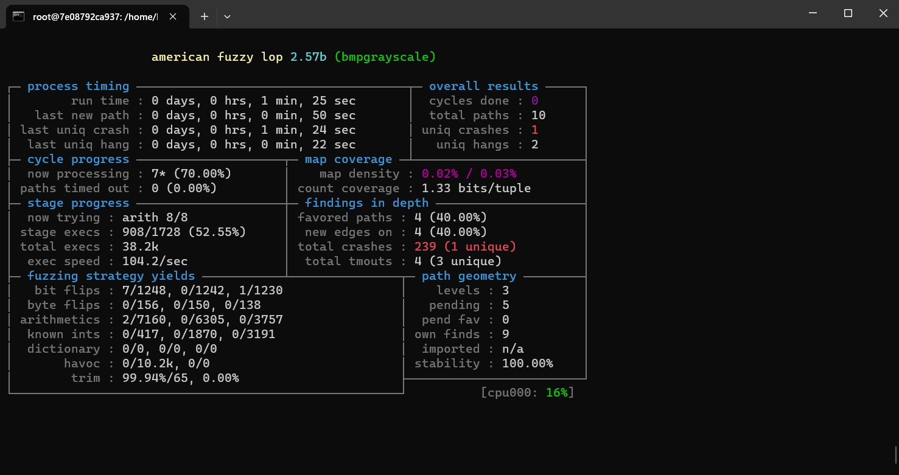
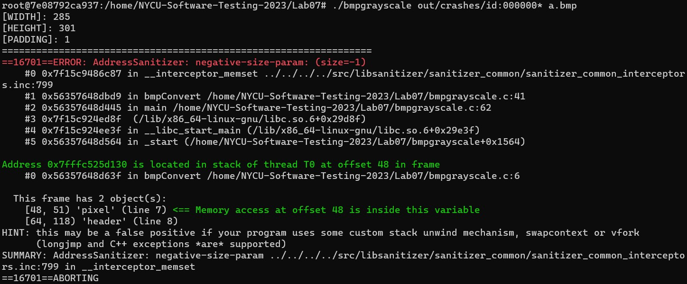

# **Lab 7 Fuzz Testing**

## **Step by Step**
Installation on Linux
```bash
$ git clone https://github.com/google/AFL.git
$ cd AFL
$ make
$ make install
```
Build & fuzz with AFL
```bash
$ cd Lab07
$ export CC=~/AFL/afl-gcc
$ export AFL_USE_ASAN=1
$ make
$ mkdir in
$ cp test.bmp in/
$ ~/AFL/afl-fuzz -i in -o out -m none -- ./bmpgrayscale @@ a.bmp
```
AFL running(with triggered crash)



ASAN error report
```bash
$ ./bmpgrayscale out/crashes/id:000000* a.bmp
```


---
## **Complement**
### **Fuzz Command**
```bash
$ afl-fuzz -i in/ -o out/ -b 10 -m none -- ./target [argv1] @@ [argv2]
```
* ```-i dir```. seed dir

* ```-o```. output dir

* ```-b CPU_ID```. bind the fuzzing process to the specified CPU core

* ```-m megs```. memory limit for child process

* ```@@```. the location of the input (if NO -> stdin)
---
### **Fuzz Result**
* ```queue/```. test cases for every distinctive execution path, plus all the starting files given by the user.


* ```crashes/```. unique test cases that cause the tested program to receive a fatal signal (e.g., SIGSEGV, SIGILL, SIGABRT).


* ```hangs/```. unique test cases that cause the tested program to time out. The default time limit before something is classified as a hang is the larger of 1 second and the value of the -t parameter.

### Note : PoC(the file that can trigger the vulnerability) is in ```./out/crashes/```.